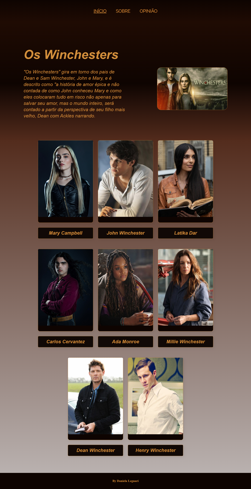
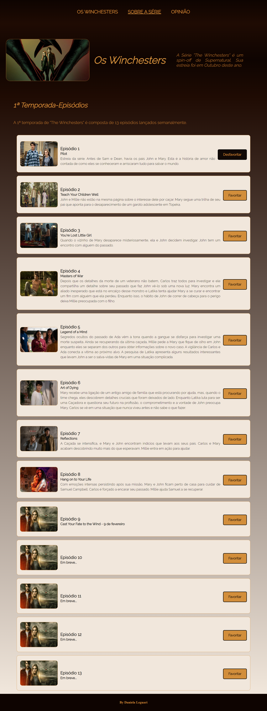
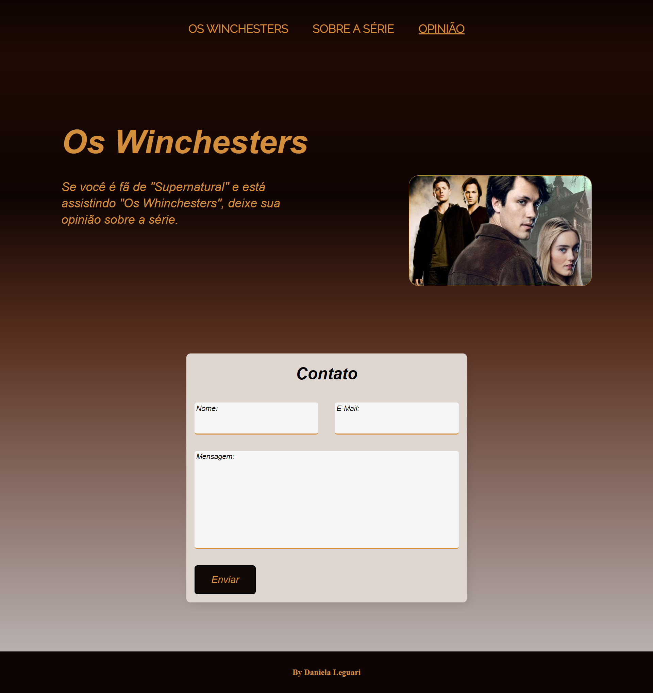
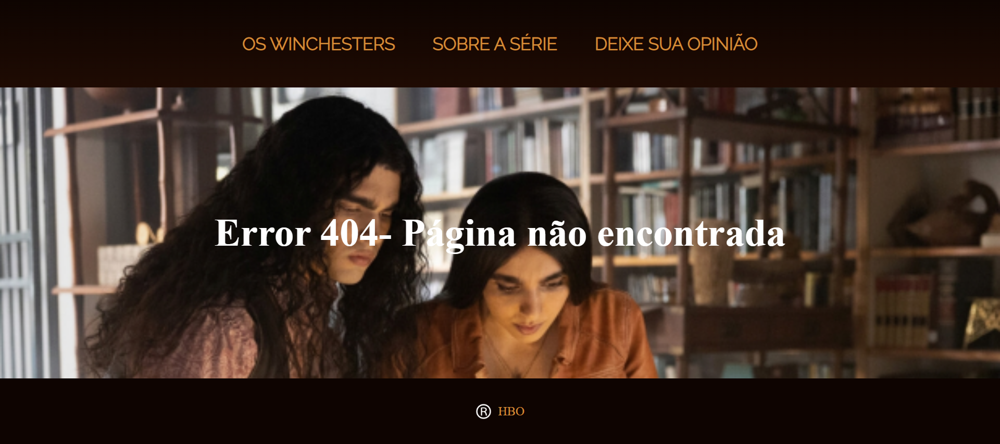

# Projeto Blog "The Winchesters"

- Obs. Este projeto encontra-se em aprimoramento

## Tecnologias utilizadas

 - TypeScript;
 - React;
 - Responsividade;
 - API construída em node.js e Mongo DB;
 - react-toastify.

# API node.js

- Para este projeto foi desenvolvido uma api em node.js, utilizando Mongo DB.

<a href='https://github.com/DanielaLeguari/api-nodejs-projetoblog'>Clique para acessar o repositório da API</a>

- Para acessar esta melhoria é preciso acessar a branch `feature/api`
- A API carrega dinamicamente o componente de episódios, mostrando os episódios da primeira temporada da série.

### Instalação do react-toastify

`npm i react-toastify`

## Comando para iniciar o projeto

### `npm start`

# Confira a aplicação acessando o link da Vercel no canto superior direito

## Páginas

### Home

### Sobre a Série

### Opinião

### Pàgina de Erro

